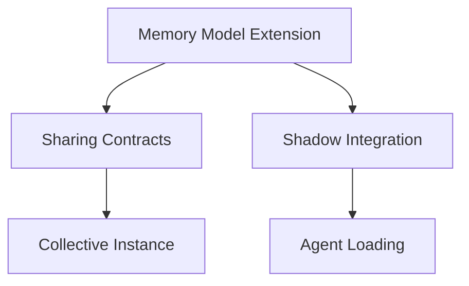
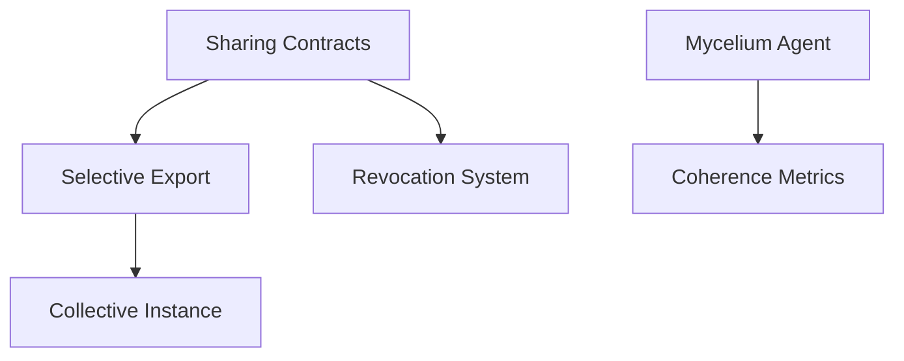
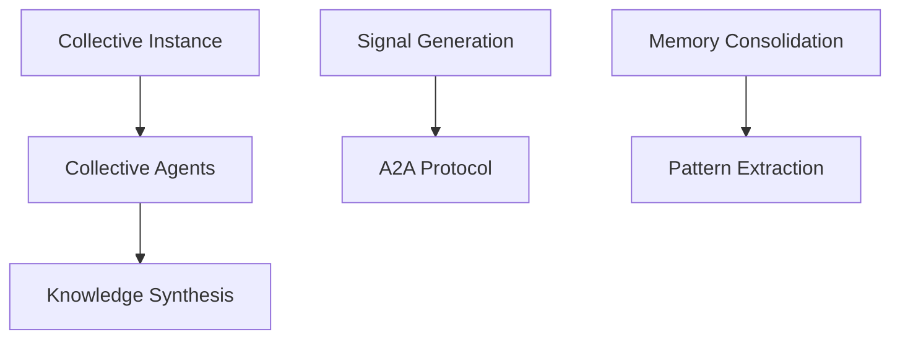

# Mnemosyne Protocol - Critical Path Dependencies

## Overview

This document identifies the critical path - the sequence of dependent tasks that determines the minimum project duration. Any delay in critical path tasks directly delays the entire project.

---

## Critical Path Visualization

```
Week 1-2: Foundation
├─► Memory Model Extension ──► Sharing Contracts ──► Collective Instance
└─► Shadow Integration ──► Mycelium Agent ──► Agent Orchestra

Week 3-4: Core Features  
├─► Signal Generation ──► A2A Protocol ──► Agent Cards
└─► Memory Consolidation ──► Selective Export ──► Privacy Layers

Week 5-6: Collective
├─► Collective Agents ──► Knowledge Synthesis ──► Trust System
└─► K-Anonymity ──► Anonymization ──► Revocation

Week 7-8: Deployment
├─► Security Audit ──► Production Config ──► Beta Launch
└─► Documentation ──► User Onboarding ──► Community Setup
```

---

## Critical Dependencies

### 1. Memory Model → Everything

**Dependency**: Extended memory model with sharing capabilities
**Blocks**: All collective features, privacy layers, trust system
**Risk**: High - Foundation for entire system
**Mitigation**: Start immediately, allocate best developer

```python
# Critical: Must be completed by Day 3
class Memory(BaseModel):
    # Existing fields...
    
    # NEW: Required for sharing
    sharing_metadata = Column(JSON)
    export_version = Column(String)
    revocable = Column(Boolean, default=True)
```

### 2. Shadow Integration → Agent Orchestra

**Dependency**: Shadow orchestration system integrated with Mnemosyne
**Blocks**: Mycelium agent, philosophical agents, collective agents
**Risk**: High - Complex integration
**Mitigation**: Use adapter pattern, maintain loose coupling

```python
# Critical: Must be completed by Day 7
class MnemosyneOrchestrator(ShadowAgent):
    def __init__(self, memory_service):
        self.memory = memory_service
        self.agents = load_shadow_agents()
        self.dialogues = load_philosophical_agents()
```

### 3. Sharing Contracts → Collective Features

**Dependency**: Contract system for selective sharing
**Blocks**: Collective instance, privacy layers, revocation
**Risk**: High - Core to sovereignty model
**Mitigation**: Simple initial implementation, iterate

```python
# Critical: Must be completed by Week 2
@dataclass
class SharingContract:
    domains: List[str]
    depth: str  # summary|detailed|full
    duration: Optional[datetime]
    revocable: bool = True
```

### 4. Collective Instance → All Collective Features

**Dependency**: Forked Mnemosyne instance with elevated permissions
**Blocks**: Matchmaker, Gap Finder, Synthesizer, trust system
**Risk**: Medium - Architectural change
**Mitigation**: Inherit from base Mnemosyne class

```python
# Critical: Must be completed by Week 3
class CollectiveCodex(MemoryService):
    def __init__(self, collective_id):
        super().__init__()
        self.collective_agents = load_collective_agents()
```

### 5. K-Anonymity → Privacy Guarantees

**Dependency**: K-anonymity implementation
**Blocks**: Safe collective queries, privacy compliance
**Risk**: High - Privacy breach if failed
**Mitigation**: Strict testing, conservative k=3 minimum

```python
# Critical: Must be completed by Week 5
def check_k_anonymity(data, k=3):
    # Must have at least k similar records
    return all(group_size >= k for group_size in groups)
```

### 6. A2A Protocol → Interoperability

**Dependency**: Agent Card generation and task handling
**Blocks**: External system integration, agent discovery
**Risk**: Medium - New specification
**Mitigation**: Start with basic implementation, enhance over time

```python
# Critical: Must be completed by Week 4
def generate_agent_card(agent):
    return {
        "name": f"mnemosyne:{agent.id}",
        "capabilities": agent.domains,
        "endpoint": f"/agents/{agent.id}"
    }
```

---

## Dependency Chain Analysis

### Chain 1: Memory → Sharing → Collective → Synthesis
**Length**: 4 steps
**Duration**: 3 weeks
**Critical**: YES - Longest path

1. Extend memory model (Day 1-3)
2. Implement sharing contracts (Day 4-7)
3. Create collective instance (Week 2)
4. Build synthesis system (Week 3-4)

### Chain 2: Shadow → Dialogues → Mycelium → Coherence
**Length**: 4 steps
**Duration**: 2 weeks
**Critical**: YES - Agent foundation

1. Integrate Shadow (Day 1-5)
2. Port Dialogues agents (Day 6-10)
3. Create Mycelium agent (Week 2)
4. Implement coherence checks (Week 3)

### Chain 3: Signal → Kartouche → A2A → Discovery
**Length**: 4 steps
**Duration**: 2 weeks
**Critical**: NO - Can parallelize

1. Generate signals (Week 2)
2. Create kartouches (Week 3)
3. Implement A2A (Week 4)
4. Enable discovery (Post-MVP)

---

## Blocking Dependencies

### Week 1 Blockers


**MUST complete by end of Week 1:**
- Memory model extension
- Shadow integration

### Week 2 Blockers


**MUST complete by end of Week 2:**
- Sharing contracts
- Mycelium agent

### Week 3-4 Blockers


**MUST complete by end of Week 4:**
- Collective instance
- Basic collective agents

---

## Risk Matrix

| Dependency | Impact | Probability | Risk Level | Mitigation |
|------------|--------|-------------|------------|------------|
| Memory Model Extension | Critical | Low | High | Start immediately |
| Shadow Integration | Critical | Medium | High | Use adapters |
| Sharing Contracts | Critical | Low | High | Simple first version |
| Collective Instance | High | Medium | High | Inherit base class |
| K-Anonymity | Critical | Low | Medium | Conservative k=3 |
| A2A Protocol | Medium | Medium | Medium | Basic first |
| Mycelium Agent | High | Low | Medium | Based on existing |
| Trust System | Medium | Medium | Low | Simple scoring |

---

## Parallelization Opportunities

### Can Run in Parallel

**Week 1-2:**
- Memory extension + Shadow integration
- Database schema + API updates
- Frontend updates + Documentation

**Week 3-4:**
- Signal generation + Collective agents
- Kartouche design + Trust system
- Privacy layers + Testing

**Week 5-6:**
- K-anonymity + Differential privacy
- A2A protocol + Network discovery
- UI polish + Security audit

### Cannot Parallelize (Sequential)

1. Memory model → Sharing contracts
2. Sharing contracts → Collective instance
3. Collective instance → Collective agents
4. Shadow integration → Mycelium agent
5. K-anonymity → Privacy testing

---

## Resource Allocation

### Critical Path Resources

**Week 1-2: Foundation**
- Senior Developer: Memory model, sharing contracts
- Mid Developer: Shadow integration
- Junior Developer: Docker setup, testing

**Week 3-4: Core Features**
- Senior Developer: Collective instance, agents
- Mid Developer: Signal generation, A2A
- Junior Developer: UI updates

**Week 5-6: Collective & Privacy**
- Senior Developer: Privacy layers, k-anonymity
- Mid Developer: Trust system, synthesis
- Security Expert: Audit, penetration testing

---

## Monitoring & Checkpoints

### Daily Standups Focus
- Is any critical path task blocked?
- Are we on track for weekly deliverables?
- Any new dependencies discovered?

### Weekly Checkpoints

**Week 1**: Memory model extended?
**Week 2**: Sharing contracts working?
**Week 3**: Collective instance running?
**Week 4**: Collective agents operational?
**Week 5**: Privacy layers active?
**Week 6**: Trust system calculating?
**Week 7**: Security audit started?
**Week 8**: Ready for beta launch?

---

## Contingency Plans

### If Memory Model Delayed
- Reduce sharing contract complexity
- Build minimal collective features first
- Extended timeline by 1 week

### If Shadow Integration Fails
- Use simplified orchestration
- Reduce initial agent count
- Port agents incrementally

### If Privacy Implementation Delayed
- Launch with k-anonymity only
- Add differential privacy post-MVP
- Limit initial collective size

### If Collective Features Delayed
- Launch individual-only MVP
- Add collective in v1.1
- Focus on personal sovereignty

---

## Critical Success Factors

1. **Memory model extension** must be perfect - it's the foundation
2. **Sharing contracts** must be secure - sovereignty depends on it  
3. **K-anonymity** must work - privacy is non-negotiable
4. **Collective instance** must scale - even if limited initially
5. **Documentation** must be clear - adoption depends on it

---

## Recommended Actions

### Immediate (Day 1)
1. Assign senior developer to memory model
2. Start Shadow integration in parallel
3. Set up unified repository structure
4. Create development environment

### Week 1
1. Complete memory model extension
2. Design sharing contract schema
3. Test Shadow integration
4. Begin Mycelium agent

### Week 2
1. Implement sharing contracts
2. Start collective instance
3. Port first philosophical agents
4. Create signal generator

### Ongoing
1. Daily dependency check
2. Weekly critical path review
3. Bi-weekly risk assessment
4. Continuous integration testing

---

*The critical path is clear: Memory → Sharing → Collective → Synthesis. Stay on this path for successful MVP delivery in 8 weeks.*