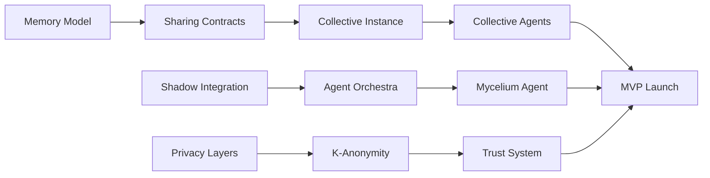

# The Mnemosyne Protocol - Development Roadmap

## Philosophy: No Mocking, Only Real Implementation

We build real features or we defer them. No fake implementations, no mock systems. Every line of code serves actual sovereignty.

---

## Current Status (2025-08-06)

✅ **Completed**:
- Repository integration (4 codebases merged)
- Research phase (7 studies completed)
- Documentation suite (6 core documents)
- Docker configuration

🚧 **In Progress**:
- Memory model extension (Week 1)

📋 **Upcoming**:
- Shadow integration
- Collective layer
- Privacy implementation

---

## Phase 1: MVP (2-3 Weeks with AI Development)

### Day 1-3: Foundation Integration ⚡ CURRENT
**Goal**: Unified system with sharing capabilities

| Task | Time Est | Status | AI/Human |
|------|----------|--------|----------|
| ✅ Merge codebases | 1 hour | Complete | AI |
| ✅ Create repository | 30 min | Complete | AI |
| Extend memory model | 2-4 hours | 🚧 Next | AI |
| Add sharing contracts | 2-3 hours | ⏳ | AI |
| Integrate Shadow orchestration | 4-6 hours | ⏳ | AI |
| Create Mycelium agent | 2-3 hours | ⏳ | AI |
| Database migrations | 1-2 hours | ⏳ | AI |

### Day 4-7: Core Intelligence
**Goal**: Memory consolidation and identity generation

| Task | Time Est | Status | AI/Human |
|------|----------|--------|----------|
| Memory consolidation (REM) | 4-6 hours | ⏳ | AI |
| Signal generator | 3-4 hours | ⏳ | AI |
| Kartouche visualizer (SVG) | 2-3 hours | ⏳ | AI |
| Fracture index calculator | 2-3 hours | ⏳ | AI |
| Port 10 philosophical agents | 2-3 hours | ⏳ | AI |
| Basic A2A protocol | 3-4 hours | ⏳ | AI |

### Day 8-11: Collective Layer
**Goal**: Enable community intelligence

| Task | Time Est | Status | AI/Human |
|------|----------|--------|----------|
| Collective instance | 3-4 hours | ⏳ | AI |
| Matchmaker agent | 2-3 hours | ⏳ | AI |
| Gap Finder agent | 2-3 hours | ⏳ | AI |
| Synthesizer agent | 2-3 hours | ⏳ | AI |
| K-anonymity (k=3) | 2-3 hours | ⏳ | AI |
| Basic trust system | 3-4 hours | ⏳ | AI |
| Revocation system | 2-3 hours | ⏳ | AI |

### Day 12-14: Testing & Polish
**Goal**: Production-ready deployment

| Task | Time Est | Status | AI/Human |
|------|----------|--------|----------|
| Integration testing | 3-4 hours | ⏳ | AI + Human |
| Security audit | 1 day | ⏳ | Human |
| Performance testing | 4 hours | ⏳ | AI + Human |
| UI polish | 2-3 hours | ⏳ | AI |
| Documentation updates | 2-3 hours | ⏳ | AI |
| Beta deployment | 1-2 hours | ⏳ | AI + Human |

---

## Phase 2: Full Protocol (Month 3-6)

### Features Deferred from MVP (Build Real When Ready)

| Feature | Why Deferred | When Ready | Implementation |
|---------|--------------|------------|----------------|
| Zero-Knowledge Proofs | Complex cryptography | Month 3 | Real implementation only |
| DHT Discovery (libp2p) | Network complexity | Month 3 | Real P2P network |
| IPFS Integration | Distributed storage | Month 4 | Real IPFS nodes |
| Differential Privacy | Statistical complexity | Month 4 | Real ε-differential privacy |
| Homomorphic Encryption | Heavy computation | Month 5 | Real CKKS scheme |
| 40+ Additional Agents | Scale testing needed | Month 5 | Real agent implementations |
| Crisis Mode | Complex coordination | Month 6 | Real emergency protocol |
| Mobile Apps | Platform complexity | Month 6 | Native iOS/Android |

---

## Phase 3: Ecosystem (Month 6-12)

### Community Features

| Feature | Purpose | Timeline |
|---------|---------|----------|
| Public API | External integrations | Month 7 |
| Plugin System | Community extensions | Month 8 |
| Governance Token | Decentralized decisions | Month 9 |
| Federation Protocol | Cross-network bridges | Month 10 |
| Academic Partnerships | Research validation | Month 11 |
| Open Source Release | Full community ownership | Month 12 |

---

## Technology Stack Evolution

### MVP Stack (Now)
```
Frontend:  React + TypeScript + Vite
Backend:   FastAPI + PostgreSQL + pgvector
Agents:    Python + LangChain + Shadow
Protocol:  A2A (basic implementation)
Privacy:   K-anonymity + AES-256
Deploy:    Docker Compose
```

### Enhanced Stack (Month 3-6)
```
Frontend:  + React Native (mobile)
Backend:   + Redis clustering + IPFS
Agents:    + 50 philosophical agents
Protocol:  + Full A2A + libp2p
Privacy:   + ZK-SNARKs + Differential Privacy
Deploy:    + Kubernetes + Monitoring
```

### Ecosystem Stack (Month 6-12)
```
Frontend:  + Native mobile + AR
Backend:   + Federation + Blockchain
Agents:    + Community agents + Plugins
Protocol:  + ActivityPub + Custom DHT
Privacy:   + Homomorphic + Secure MPC
Deploy:    + Global CDN + Edge compute
```

---

## Success Metrics by Phase

### MVP Success (Week 2-3)
- [ ] 10+ active users
- [ ] 2+ test collectives
- [ ] 100+ memories per user
- [ ] 5+ skill matches made
- [ ] Zero privacy breaches
- [ ] All features REAL (no mocks)

### Protocol Success (Month 6)
- [ ] 100+ active users
- [ ] 10+ active collectives
- [ ] 1000+ memories per user
- [ ] Cross-collective knowledge exchange
- [ ] Community contributions
- [ ] Security audit passed

### Ecosystem Success (Month 12)
- [ ] 1000+ active users
- [ ] 50+ active collectives
- [ ] Self-sustaining development
- [ ] Academic validation
- [ ] Cultural integration beginning
- [ ] Protocol evolution through use

---

## Critical Path Dependencies



---

## Risk Management

### Technical Risks
| Risk | Impact | Mitigation |
|------|--------|------------|
| Privacy breach | Critical | K-anonymity, audit, conservative defaults |
| Performance issues | High | Caching, async, load testing |
| Integration complexity | Medium | Modular architecture, adapters |
| Agent incoherence | Medium | Mycelium monitoring, fracture index |

### Adoption Risks
| Risk | Impact | Mitigation |
|------|--------|------------|
| User confusion | High | Clear onboarding, immediate value |
| Trust bootstrapping | High | Progressive revelation, reputation |
| Community building | Medium | Early adopter program, documentation |
| Sustainability | Medium | Open source, community ownership |

---

## Development Principles

1. **No Mocking**: Build real or defer
2. **Privacy First**: Every feature respects sovereignty
3. **Modular**: Each component provides standalone value
4. **Documented**: Code explains itself, docs explain why
5. **Tested**: Security > Features
6. **Open**: Community ownership from day one

---

## How It All Comes Together

### The User Journey

**Week 1-2**: Individual Memory
- User installs personal Mnemosyne
- Captures thoughts and memories
- Agents begin reflecting and organizing

**Week 3-4**: Identity Formation
- System generates Deep Signal
- Creates visual kartouche
- User refines their symbolic identity

**Week 5-6**: Collective Connection
- User joins first collective
- Shares selected memories
- Discovers complementary skills
- Builds trust through interaction

**Week 7-8**: Emergent Intelligence
- Collective synthesizes knowledge
- Gaps identified and filled
- Community resilience increases
- Network effects begin

### The Technical Journey

**Foundation**: Merge existing code → extend for sharing
**Intelligence**: Add agents → create orchestration
**Identity**: Generate signals → visualize symbols
**Community**: Enable sharing → preserve privacy
**Trust**: Build reputation → prevent gaming
**Scale**: Optimize → deploy → monitor

---

## Call to Action

### For Developers
- Pick a task from TASK_TRACKING.md
- No mocking - build real features
- Document as you code
- Test security implications

### For Early Adopters
- Install personal instance (Week 2)
- Provide feedback on UX
- Help test collective features (Week 5)
- Build the first communities

### For Philosophers
- Review agent implementations
- Suggest new archetypes
- Test debate dynamics
- Guide symbolic development

---

*"We build real tools for real sovereignty. No shortcuts, no fakes, no surveillance."*

**The path is clear. The code is ready. Let's build what comes next.**

---

*Last Updated: 2025-08-06*  
*Next Milestone: Memory model extension (Week 1)*