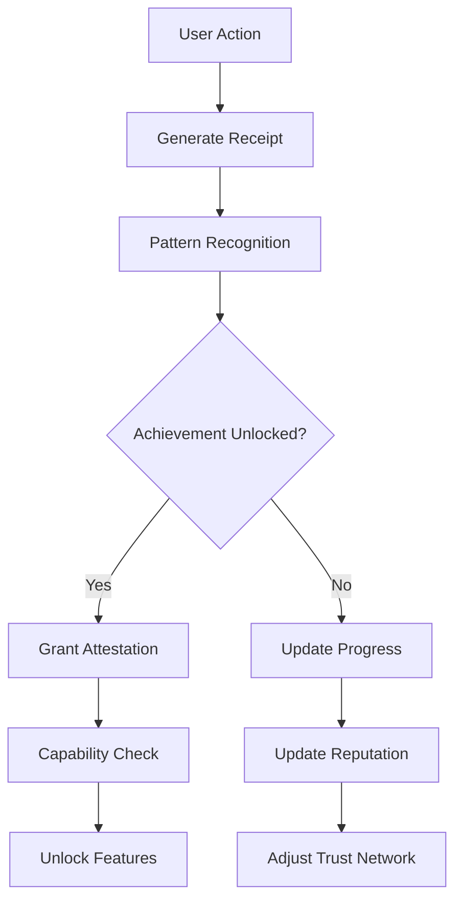

# Game Mechanics Research Findings for Mnemosyne
*Analysis of gamification and MMO dynamics for cognitive sovereignty*
*Created: August 24, 2025*

## Executive Summary

Game theory and MMO mechanics offer powerful patterns for Mnemosyne's trust networks and collective intelligence, but must be carefully adapted to preserve sovereignty and avoid manipulation. The research reveals strong alignment between existing Mnemosyne concepts (ICV, masks, receipts) and proven game mechanics, suggesting a natural evolution rather than forced integration.

**Key Insight**: Mnemosyne's architecture already contains implicit game mechanics - we're making them explicit and intentional.

## Core Findings

### 1. Natural Alignment with Existing Architecture

#### ICV as Character Development
The Identity Compression Vector naturally maps to character progression:
- **Current**: Static values captured at onboarding
- **Enhanced**: Dynamic evolution through interactions
- **Mechanism**: Each action adjusts weights slightly (5% productive variation)
- **Benefit**: Users see growth without losing core identity

#### Masks as Role Specialization
Contextual presentation already functions as class/role system:
- **Current**: Privacy-focused context switching
- **Enhanced**: Capability unlocks per mask level
- **Mechanism**: Mask proficiency grows through use
- **Benefit**: Natural skill development in chosen contexts

#### Receipts as Achievement System
The consent ledger is essentially an achievement log:
- **Current**: Audit trail for transparency
- **Enhanced**: Derivable attestations and capabilities
- **Mechanism**: Pattern recognition in receipt streams
- **Benefit**: Reputation emerges from actual behavior

### 2. Trust Building Through Game Mechanics

#### Progressive Disclosure as Quest Chains
Trust networks map perfectly to MMO quest progressions:
```
Initial Contact → Surface Exchange → Depth Sharing → Vulnerability → Integration
    (Tutorial)     (Daily Quest)    (Dungeon Run)    (Raid Prep)    (Guild Form)
```

#### Cooperative Challenges Build Trust Faster
Research shows shared challenges create stronger bonds than passive interaction:
- **2-person challenges**: Basic trust formation (prisoner's dilemma variations)
- **5-person challenges**: Role specialization emerges
- **12-person challenges**: Leadership and coordination patterns
- **50+ person events**: Collective intelligence phenomena

#### Reputation as Multi-Dimensional Social Capital
Instead of single trust score, use MMO-style faction reputation:
- **Craft**: Technical skill and execution
- **Care**: Empathy and support actions  
- **Rigor**: Thoroughness and reliability
- **Novelty**: Creative contributions
- **Stewardship**: Community maintenance

### 3. Collective Dynamics from MMO Patterns

#### Guild Formation Mechanics
Natural clustering happens through:
1. **Shared Challenges**: Groups form around common goals
2. **Resource Pooling**: Collective capabilities exceed individual
3. **Charter Creation**: Explicit values and boundaries
4. **Ritual Development**: Regular practices that bind
5. **Conflict Resolution**: Internal governance emerges

#### Raid Mechanics for Collective Intelligence
Complex problems require diverse roles:
- **Scout**: Information gathering and reconnaissance
- **Analyst**: Pattern recognition and strategy
- **Builder**: Implementation and creation
- **Guardian**: Quality control and protection
- **Shepherd**: Coordination and facilitation

#### Economy Without Currency
Reputation and capabilities as non-transferable wealth:
- **Attestations**: Proof of completed challenges
- **Capabilities**: Unlocked features from achievements
- **Access**: Guild membership and resource pools
- **Influence**: Weight in collective decisions

### 4. Anti-Addiction and Ethical Design

#### Healthy Engagement Patterns
- **Session-based play**: 90-minute focused sessions vs endless grind
- **Reflection prompts**: Post-session review instead of immediate re-engagement
- **Diminishing returns**: Reduced rewards for marathon sessions
- **Natural breaks**: Built-in cooldowns and recovery periods

#### Avoiding Dark Patterns
- **No pay-to-win**: All capabilities earned through participation
- **No FOMO mechanics**: Seasonal content remains accessible
- **No manipulation**: Transparent mechanics with visible formulas
- **No grinding**: Quality over quantity in all metrics

#### Consent and Agency Preservation
- **Opt-in everything**: No forced gamification
- **Visible off-ramps**: Easy to step back without penalty
- **Private by default**: Achievements visible only by choice
- **No comparison pressure**: Rankings optional and contextual

### 5. Worldview Adaptation Strategies

#### Cultural Preference Mapping
Different worldviews prefer different mechanics:

**Individualist Worldview**:
- Personal achievement focus
- Skill-based progression
- Solo challenges available
- Self-directed goals

**Collectivist Worldview**:
- Group achievement emphasis
- Relationship-based progression
- Team challenges prioritized
- Consensus-driven goals

**Competitive Worldview**:
- Leaderboards and rankings
- PvP debate mechanisms
- Performance metrics
- Win conditions

**Cooperative Worldview**:
- Mutual aid systems
- Shared resource pools
- Collaborative challenges
- Success through support

#### Adaptive Mechanics
System detects preference through behavior:
- Track participation patterns
- Adjust offered challenges
- Modify reward structures
- Adapt visibility settings

### 6. Implementation Architecture

#### Data Model Extensions

```python
# Quest/Challenge System
class Challenge:
    id: UUID
    type: ChallengeType  # personal, paired, group, collective
    objectives: List[Objective]
    required_masks: List[MaskType]
    required_trust_level: int
    time_limit: Optional[int]
    rewards: ChallengeRewards
    
class ChallengeRewards:
    attestations: List[Attestation]
    capabilities: List[Capability]
    reputation_changes: Dict[str, int]
    
# Reputation System  
class Reputation:
    user_id: UUID
    dimensions: Dict[str, float]  # craft, care, rigor, novelty, stewardship
    decay_rate: float  # half-life in days
    visibility_mask: MaskType
    
# Guild/Collective System
class Collective:
    id: UUID
    charter: CollectiveCharter
    members: List[Member]
    resources: ResourcePool
    challenges_completed: List[UUID]
    reputation: CollectiveReputation
```

#### Event Flow Patterns



### 7. Phased Integration Strategy

#### Phase 1: Foundation (Months 1-2)
- Implement multi-dimensional reputation
- Add basic challenge structure
- Create attestation system from receipts
- Design capability unlock framework

#### Phase 2: Social Dynamics (Months 3-4)
- Enable paired challenges
- Implement role specialization
- Create collective formation mechanics
- Add resource pooling systems

#### Phase 3: Complex Challenges (Months 5-6)
- Design raid-equivalent events
- Implement coordination mechanics
- Create cross-collective interactions
- Add governance systems

#### Phase 4: Emergent Intelligence (Months 7+)
- Enable collective decision making
- Implement consensus mechanisms
- Create federation protocols
- Add inter-collective challenges

### 8. Risk Mitigation Strategies

#### Gaming Prevention
- **Sybil Resistance**: Proof-of-human via progressive trust
- **Collusion Detection**: Statistical analysis of interaction patterns
- **Exploit Prevention**: Rate limiting and anomaly detection
- **Farming Prevention**: Diminishing returns on repetitive actions

#### Social Toxicity Prevention
- **Instanced Interactions**: No public spectacle
- **Positive-Sum Design**: Success doesn't require others' failure
- **Moderation Tools**: Community-driven governance
- **Recovery Mechanisms**: Reputation rehabilitation paths

#### Philosophical Integrity
- **Values Preservation**: Mechanics serve sovereignty
- **Consent Maintenance**: Every interaction voluntary
- **Privacy Protection**: Default invisibility
- **Agency Support**: Tools not rules

## Key Recommendations

### Immediate Implementation (This Sprint)
1. **Multi-dimensional Reputation Model**
   - Extend user model with reputation dimensions
   - Add decay calculations
   - Create visibility controls

2. **Basic Challenge Structure**
   - Define challenge types and objectives
   - Create completion tracking
   - Implement simple attestations

3. **Receipt Pattern Recognition**
   - Identify achievement patterns
   - Create derivation rules
   - Build attestation generation

### Next Sprint
4. **Role Specialization via Masks**
   - Add proficiency tracking per mask
   - Create capability unlocks
   - Implement role-based tools

5. **Paired Challenges**
   - Design trust-building exercises
   - Implement coordination mechanics
   - Create mutual attestations

### Future Sprints
6. **Collective Formation**
   - Guild charter system
   - Resource pooling mechanics
   - Collective challenges

7. **Complex Events**
   - Raid-style coordination
   - Cross-collective interactions
   - Emergent leadership

## Conceptual Synthesis

### The Mnemosyne Game Loop
```
1. Set Intention (Quest Selection)
   ↓
2. Take Action (Challenge Participation)
   ↓
3. Generate Receipt (Automatic Logging)
   ↓
4. Receive Feedback (Progress/Achievements)
   ↓
5. Adjust Identity (ICV Evolution)
   ↓
6. Build Trust (Reputation Changes)
   ↓
7. Unlock Capabilities (New Tools/Access)
   ↓
8. Form Collectives (Guild Creation)
   ↓
9. Tackle Bigger Challenges (Raids)
   ↓
10. Emerge Intelligence (Collective Cognition)
```

### Core Design Principles
1. **Intrinsic Motivation**: Rewards align with user values
2. **Progressive Complexity**: Simple start, emergent depth
3. **Social Scaffolding**: Others help you grow
4. **Meaningful Choice**: Decisions matter and persist
5. **Transparent Mechanics**: No hidden manipulation
6. **Recovery Possible**: Failure is learning
7. **Joy Through Discovery**: Delight in unexpected connections

## Conclusion

Game mechanics and MMO dynamics offer powerful tools for enhancing Mnemosyne's trust networks and collective intelligence capabilities. The key is careful adaptation that preserves sovereignty while enabling engagement. By treating gamification as an emergent property of the existing architecture rather than a bolted-on system, we can create natural, ethical, and effective engagement patterns that scale from individual growth to collective intelligence.

The proposed integration is not about making Mnemosyne a game, but about recognizing that human coordination and trust-building inherently follow game-theoretic patterns. By making these patterns explicit and designing them intentionally, we can accelerate trust formation, enhance collective intelligence, and create joyful experiences while maintaining cognitive sovereignty.

---

*Next: Create synthesis document showing specific integration points with current Mnemosyne architecture.*