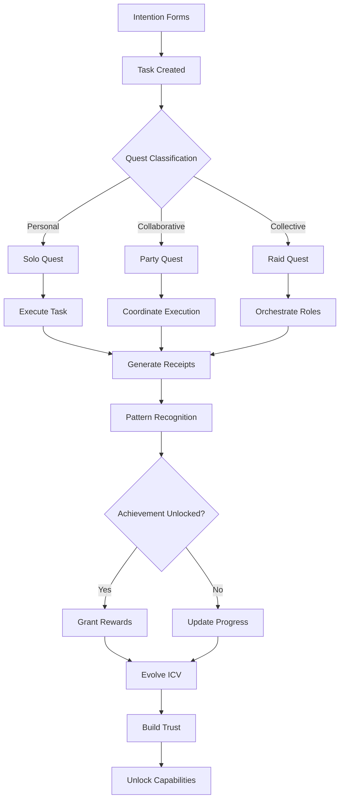

# Task Tracking & Time Awareness: The Integration Point
*Unifying game mechanics, collective coordination, and cognitive sovereignty*
*Created: August 24, 2025*

## Executive Summary

Task tracking isn't just a feature—it's the bridge between individual sovereignty and collective intelligence. By implementing a time-aware, gamified task system, we create the practical substrate for trust building, ICV evolution, and collective coordination. This isn't OpenProject bolted onto Mnemosyne; it's task management reimagined through the lens of cognitive sovereignty.

**Core Insight**: Tasks are the atomic unit of intentional action. By tracking them, we track identity formation, trust building, and collective emergence.

## The Integration Opportunity

### Why Task Tracking is Critical

Looking at the current Mnemosyne vision and roadmap, several threads converge on task management:

1. **ICV Evolution**: Every task completed shapes identity
2. **Trust Building**: Shared tasks create shared trust
3. **Game Mechanics**: Tasks ARE quests with natural rewards
4. **Collective Intelligence**: Coordination requires task synchronization
5. **Receipts/Consent**: Every task generates audit trail
6. **Persona Guidance**: AI suggests tasks based on growth needs

### Current Gap Analysis

**What Mnemosyne Has**:
- Memory system (past-focused)
- Chat system (present-focused)
- Trust networks (relationship-focused)

**What's Missing**:
- Future-focused intention capture
- Time awareness and scheduling
- Dependency tracking
- Progress visualization
- Collective coordination

**What Task Tracking Adds**:
- Bridges past (memories) to future (intentions)
- Creates concrete trust-building opportunities
- Natural game mechanics emerge from task completion
- Enables collective action coordination

## Conceptual Architecture

### Tasks as Multi-Dimensional Objects

```python
class Task:
    """Tasks are intentions with temporal, social, and identity dimensions"""
    
    # Core Properties
    id: UUID
    title: str
    description: str
    creator_id: UUID
    
    # Temporal Dimension (Time Awareness)
    created_at: datetime
    due_date: Optional[datetime]
    estimated_duration: timedelta
    actual_duration: Optional[timedelta]
    recurrence_pattern: Optional[RecurrenceRule]  # RRULE format
    
    # Social Dimension (Trust Building)
    visibility_mask: Mask  # Who can see this task
    assignees: List[UUID]  # Solo or collaborative
    dependencies: List[UUID]  # Tasks that must complete first
    parent_task: Optional[UUID]  # Hierarchical structure
    collective_id: Optional[UUID]  # Guild/group ownership
    
    # Game Dimension (Engagement)
    difficulty: int  # 1-5 complexity rating
    quest_type: QuestType  # tutorial, daily, challenge, epic
    rewards: Rewards  # What completing gives you
    required_capabilities: List[Capability]  # What you need to attempt
    
    # Identity Dimension (ICV Evolution)
    value_alignment: Dict[str, float]  # How task aligns with values
    skill_development: Dict[str, float]  # What skills it builds
    worldview_impact: Dict[str, float]  # How it shapes perspective
    
    # Sovereignty Dimension (Consent & Privacy)
    consent_required: List[ConsentType]  # What permissions needed
    data_generated: List[DataType]  # What will be created
    receipts: List[Receipt]  # Audit trail
    
    # Completion Tracking
    status: TaskStatus  # pending, active, completed, cancelled
    progress: float  # 0.0 to 1.0
    completion_evidence: List[Evidence]  # Proof of completion
    attestations: List[Attestation]  # Verifications from others
```

### Task Lifecycle with Game Mechanics



## Integration with Existing Architecture

### 1. Memory System Integration

Tasks bridge past and future:

```python
class TaskMemoryBridge:
    """Connect tasks to memory system"""
    
    def task_to_memory(self, task: Task) -> Memory:
        """Completed tasks become memories"""
        return Memory(
            content=f"Completed: {task.title}",
            metadata={
                'task_id': task.id,
                'duration': task.actual_duration,
                'collaborators': task.assignees,
                'achievement': task.rewards
            },
            importance=task.difficulty * task.progress
        )
    
    def memory_to_task(self, memory: Memory) -> Task:
        """Memories can inspire future tasks"""
        return Task(
            title=f"Revisit: {memory.content[:50]}",
            description=f"Reflection inspired by memory {memory.id}",
            value_alignment=memory.extracted_values
        )
```

### 2. Persona System Integration

Personas guide task selection:

```python
class PersonaTaskGuidance:
    """Personas suggest tasks based on user needs"""
    
    def suggest_tasks(self, user: User, persona_mode: PersonaMode) -> List[Task]:
        if persona_mode == PersonaMode.MENTOR:
            # Skill-building tasks
            return self.get_learning_tasks(user.skill_gaps)
        
        elif persona_mode == PersonaMode.CONFIDANT:
            # Reflection and processing tasks
            return self.get_reflection_tasks(user.recent_experiences)
        
        elif persona_mode == PersonaMode.MEDIATOR:
            # Conflict resolution tasks
            return self.get_mediation_tasks(user.active_conflicts)
        
        elif persona_mode == PersonaMode.GUARDIAN:
            # Wellbeing maintenance tasks
            return self.get_wellbeing_tasks(user.health_metrics)
```

### 3. Trust Network Integration

Tasks build trust through collaboration:

```python
class TrustBuildingTasks:
    """Tasks designed to build trust between users"""
    
    task_templates = {
        'initial_exchange': {
            'title': 'Share Three Values',
            'trust_required': 1,
            'trust_gained': 0.5,
            'bilateral': True
        },
        'collaborative_creation': {
            'title': 'Co-create a Memory',
            'trust_required': 2,
            'trust_gained': 1.0,
            'requires_sync': True
        },
        'vulnerability_exercise': {
            'title': 'Share a Challenge',
            'trust_required': 3,
            'trust_gained': 1.5,
            'requires_reciprocity': True
        }
    }
    
    def create_trust_task(self, user_a: User, user_b: User) -> Task:
        """Generate appropriate trust-building task"""
        current_trust = self.get_trust_level(user_a, user_b)
        appropriate_tasks = [
            t for t in self.task_templates.values()
            if t['trust_required'] <= current_trust
        ]
        return self.instantiate_task(random.choice(appropriate_tasks))
```

### 4. Game Mechanics Integration

Tasks ARE quests:

```python
class TaskQuestSystem:
    """Treat tasks as quests with game mechanics"""
    
    def classify_task(self, task: Task) -> QuestType:
        """Determine quest type from task properties"""
        if task.estimated_duration < timedelta(minutes=15):
            return QuestType.DAILY
        elif len(task.assignees) == 1:
            return QuestType.SOLO
        elif len(task.assignees) <= 5:
            return QuestType.PARTY
        elif task.collective_id:
            return QuestType.RAID
        else:
            return QuestType.CHALLENGE
    
    def calculate_rewards(self, task: Task) -> Rewards:
        """Determine rewards based on task completion"""
        return Rewards(
            experience={
                'craft': task.difficulty * 10,
                'care': len(task.assignees) * 5,
                'rigor': task.progress * 20
            },
            reputation_change={
                'reliability': 1.0 if task.completed_on_time else -0.5,
                'collaboration': len(task.assignees) * 0.2
            },
            capabilities_unlocked=self.check_capability_unlocks(task)
        )
```

## Time Awareness & Calendaring

### Temporal Architecture

```python
class TemporalTaskSystem:
    """Time-aware task management"""
    
    def schedule_task(self, task: Task, user: User) -> Schedule:
        """Smart scheduling based on multiple factors"""
        
        # Consider user's circadian rhythm
        best_time = self.get_peak_performance_window(user, task.difficulty)
        
        # Check calendar conflicts
        conflicts = self.check_calendar_conflicts(user, task.due_date)
        
        # Consider dependencies
        earliest_start = self.calculate_dependency_completion(task)
        
        # Energy management
        energy_required = task.difficulty * task.estimated_duration.hours
        available_energy = self.get_available_energy(user, best_time)
        
        return Schedule(
            task_id=task.id,
            suggested_start=best_time,
            blocks_required=ceil(energy_required / available_energy),
            conflicts=conflicts,
            dependencies_met_by=earliest_start
        )
    
    def create_recurring_task(self, template: Task, pattern: str) -> List[Task]:
        """Generate recurring tasks from RRULE pattern"""
        rrule = rrulestr(pattern)
        instances = []
        
        for dt in rrule:
            instance = deepcopy(template)
            instance.due_date = dt
            instance.id = uuid4()
            instances.append(instance)
        
        return instances
```

### Calendar Integration

```python
class CalendarService:
    """Manage temporal aspects of tasks"""
    
    def get_user_calendar(self, user: User, start: date, end: date) -> Calendar:
        """Get user's task calendar"""
        tasks = self.get_tasks_in_range(user, start, end)
        
        calendar = Calendar()
        for task in tasks:
            event = Event(
                summary=task.title,
                start=task.due_date - task.estimated_duration,
                end=task.due_date,
                categories=['task', task.quest_type.value],
                transparency='OPAQUE' if task.requires_focus else 'TRANSPARENT'
            )
            calendar.add_event(event)
        
        return calendar
    
    def find_collaboration_windows(self, users: List[User]) -> List[TimeWindow]:
        """Find when multiple users can work together"""
        calendars = [self.get_user_calendar(u) for u in users]
        return self.find_overlapping_free_time(calendars)
```

## Collective Task Coordination

### Guild Task Management

```python
class CollectiveTaskSystem:
    """Manage tasks at collective level"""
    
    def create_collective_goal(self, collective: Collective, goal: str) -> Task:
        """Break down collective goal into coordinated tasks"""
        
        # Create parent epic
        epic = Task(
            title=goal,
            quest_type=QuestType.EPIC,
            collective_id=collective.id
        )
        
        # Decompose into role-specific tasks
        subtasks = []
        for role in ['scout', 'analyst', 'builder', 'guardian', 'shepherd']:
            role_task = self.create_role_task(epic, role)
            subtasks.append(role_task)
        
        # Create coordination points
        sync_points = self.identify_sync_requirements(subtasks)
        
        # Add dependencies
        self.wire_dependencies(subtasks, sync_points)
        
        return epic
    
    def assign_by_proficiency(self, tasks: List[Task], members: List[Member]):
        """Assign tasks based on member proficiency"""
        assignments = {}
        
        for task in tasks:
            # Find best member for task
            scores = {}
            for member in members:
                score = self.calculate_task_fit(task, member)
                scores[member.id] = score
            
            # Assign to highest scorer
            best_member = max(scores, key=scores.get)
            assignments[task.id] = best_member
        
        return assignments
```

### Cross-Collective Coordination

```python
class FederationTaskSystem:
    """Coordinate tasks across collectives"""
    
    def create_federation_challenge(self, collectives: List[Collective]) -> Task:
        """Create task requiring multiple collectives"""
        
        challenge = Task(
            title="Inter-Collective Research Challenge",
            quest_type=QuestType.FEDERATION,
            required_collectives=len(collectives)
        )
        
        # Create collective-specific objectives
        for collective in collectives:
            objective = self.create_collective_objective(
                challenge, 
                collective.specialization
            )
            challenge.objectives.append(objective)
        
        # Define interaction protocol
        protocol = self.create_interaction_protocol(collectives)
        challenge.coordination_protocol = protocol
        
        return challenge
```

## Implementation Strategy

### Phase 0: Foundation (Week 1)
1. **Basic Task Model**
   - Core task properties
   - Status tracking
   - Simple CRUD operations

2. **Time Properties**
   - Due dates
   - Duration estimates
   - Basic scheduling

### Phase 1: Game Integration (Week 2)
3. **Quest Classification**
   - Map tasks to quest types
   - Calculate difficulty
   - Design reward structure

4. **Achievement Detection**
   - Pattern matching on task completion
   - Unlock capabilities
   - Update reputation

### Phase 2: Calendar Integration (Week 3-4)
5. **Temporal Awareness**
   - Calendar view
   - Scheduling assistant
   - Recurring tasks

6. **Collaboration Windows**
   - Find shared time
   - Schedule sync points
   - Coordinate availability

### Phase 3: Collective Coordination (Month 2)
7. **Guild Tasks**
   - Collective goals
   - Role assignment
   - Progress tracking

8. **Dependencies**
   - Task graphs
   - Critical path
   - Bottleneck detection

### Phase 4: Advanced Features (Month 3+)
9. **AI Task Generation**
   - Persona-suggested tasks
   - Growth-oriented challenges
   - Adaptive difficulty

10. **Federation Coordination**
    - Cross-collective tasks
    - Resource sharing
    - Emergent coordination

## Integration Points

### With OpenProject (If Desired)
```python
class OpenProjectAdapter:
    """Optional integration with OpenProject"""
    
    def sync_to_openproject(self, task: Task) -> dict:
        """Export Mnemosyne task to OpenProject"""
        return {
            'subject': task.title,
            'description': task.description,
            'due_date': task.due_date.isoformat(),
            'assigned_to_id': self.map_user_id(task.assignees[0]),
            'custom_fields': {
                'mnemosyne_id': str(task.id),
                'quest_type': task.quest_type.value,
                'trust_level': task.required_trust
            }
        }
    
    def sync_from_openproject(self, op_task: dict) -> Task:
        """Import OpenProject task to Mnemosyne"""
        return Task(
            title=op_task['subject'],
            description=op_task.get('description', ''),
            due_date=datetime.fromisoformat(op_task['due_date']),
            external_id=op_task['id'],
            external_system='openproject'
        )
```

### Or Native Implementation
```python
class MnemosyneTaskEngine:
    """Native task management with sovereignty focus"""
    
    features = {
        'time_aware': True,          # Full calendar integration
        'gamified': True,            # Quest and achievement system
        'collaborative': True,        # Multi-user coordination
        'sovereign': True,           # Privacy and consent built-in
        'ai_guided': True,           # Persona suggestions
        'collective_ready': True,    # Guild/federation support
        'identity_shaping': True,    # ICV evolution tracking
        'trust_building': True       # Progressive disclosure tasks
    }
    
    def __init__(self):
        self.calendar = CalendarService()
        self.quests = TaskQuestSystem()
        self.coordinator = CollectiveTaskSystem()
        self.ai_guide = PersonaTaskGuidance()
        self.trust_builder = TrustBuildingTasks()
```

## Why This Matters

### For Individual Users
- **Intentionality**: Tasks make implicit goals explicit
- **Growth Tracking**: See how actions shape identity
- **Time Sovereignty**: Control your temporal allocation
- **Meaningful Progress**: Every task builds toward something

### For Trust Networks
- **Concrete Collaboration**: Shared tasks build real trust
- **Coordination Substrate**: Tasks are the unit of cooperation
- **Mutual Accountability**: Visible progress and dependencies
- **Collective Memory**: Completed tasks become shared history

### For Collective Intelligence
- **Emergent Coordination**: Task patterns reveal group intelligence
- **Resource Optimization**: Assign by capability and availability
- **Collective Goals**: Break down big visions into tasks
- **Federation Protocol**: Tasks as inter-collective language

## Risk Mitigation

### Avoiding Overwhelm
- Limit daily task suggestions
- Energy-aware scheduling
- Break detection and enforcement
- "Task bankruptcy" option

### Maintaining Sovereignty
- All tasks optional
- Private by default
- No external pressure
- User controls visibility

### Preventing Gaming
- Verify completion evidence
- Peer attestation for important tasks
- Diminishing returns on repetitive tasks
- Quality over quantity metrics

## Conclusion

Task tracking isn't just a feature to add—it's the practical substrate that connects all of Mnemosyne's ambitious concepts:

- **ICV Evolution**: Tasks shape identity through action
- **Trust Building**: Shared tasks create shared trust
- **Game Mechanics**: Tasks naturally become quests
- **Time Awareness**: Scheduling creates temporal sovereignty
- **Collective Intelligence**: Coordination happens through tasks

By implementing a sovereign, time-aware, gamified task system, we create the bridge from individual intention to collective intelligence. This isn't project management software—it's the action layer of cognitive sovereignty.

---

*Next: Detailed implementation plan showing how to build this incrementally while maintaining current development momentum.*