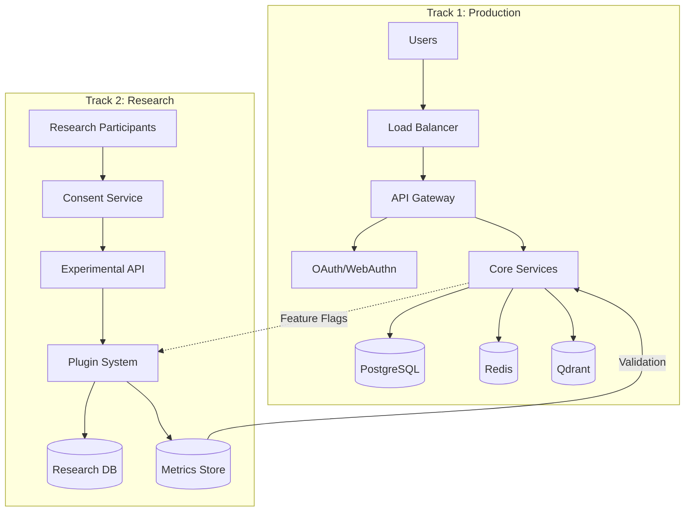

# System Architecture - Dual-Track Design

## Overview



## Component Architecture

### Core Components (Track 1)

#### API Gateway
```python
# FastAPI with production middleware
app = FastAPI(
    title="Mnemosyne Protocol",
    version="2.0.0",
    docs_url="/api/docs",
)

# Middleware stack
app.add_middleware(CORSMiddleware, allow_origins=ALLOWED_ORIGINS)
app.add_middleware(RateLimitMiddleware, limits=RATE_LIMITS)
app.add_middleware(SecurityHeadersMiddleware)
app.add_middleware(RequestValidationMiddleware)
app.add_middleware(AuditLogMiddleware)
```

#### Authentication Service
```python
class AuthenticationService:
    def __init__(self):
        self.oauth_provider = OAuthProvider()
        self.webauthn = WebAuthnProvider()
        self.did_resolver = DIDResolver()
    
    async def authenticate(self, request: Request) -> User:
        # Try OAuth first
        if oauth_token := request.headers.get("Authorization"):
            return await self.oauth_provider.verify(oauth_token)
        
        # Try WebAuthn
        if webauthn_assertion := request.json.get("assertion"):
            return await self.webauthn.verify(webauthn_assertion)
        
        # Try DID
        if did := request.headers.get("X-DID"):
            return await self.did_resolver.authenticate(did)
        
        raise AuthenticationError()
```

#### Memory Service
```python
class MemoryService:
    def __init__(self):
        self.db = AsyncPostgreSQL()
        self.vector_store = QdrantClient()
        self.cache = RedisCache()
        self.encryptor = AESEncryption()
    
    async def store_memory(self, user_id: str, content: str) -> Memory:
        # Generate embedding
        embedding = await self.generate_embedding(content)
        
        # Encrypt sensitive data
        encrypted_content = self.encryptor.encrypt(content)
        
        # Store in database
        memory = await self.db.create(
            Memory,
            user_id=user_id,
            content=encrypted_content,
            created_at=datetime.utcnow()
        )
        
        # Store in vector database
        await self.vector_store.upsert(
            collection="memories",
            points=[{
                "id": memory.id,
                "vector": embedding,
                "payload": {"user_id": user_id}
            }]
        )
        
        # Invalidate cache
        await self.cache.delete(f"user:{user_id}:memories")
        
        return memory
```

### Research Components (Track 2)

#### Plugin Architecture
```python
class PluginRegistry:
    def __init__(self):
        self.plugins: Dict[str, Plugin] = {}
        self.feature_flags = FeatureFlags()
    
    def register(self, plugin: Plugin):
        # Validate plugin
        if not plugin.hypothesis_doc:
            raise ValueError("Plugin must have hypothesis documentation")
        
        if not plugin.consent_required:
            raise ValueError("Research plugins must require consent")
        
        # Check feature flag
        if not self.feature_flags.is_enabled(plugin.feature_id):
            logger.info(f"Plugin {plugin.name} registered but disabled")
        
        self.plugins[plugin.name] = plugin
    
    async def execute(self, plugin_name: str, user_id: str, *args, **kwargs):
        plugin = self.plugins.get(plugin_name)
        
        # Check consent
        if not await self.has_consent(user_id, plugin.experiment_id):
            raise ConsentRequired(plugin.experiment_id)
        
        # Execute in isolation
        result = await self.sandbox_execute(plugin, *args, **kwargs)
        
        # Log metrics
        await self.log_metrics(plugin_name, user_id, result)
        
        return result
```

#### Research Bus
```python
class ResearchBus:
    def __init__(self):
        self.redis = RedisClient()
        self.anonymizer = DataAnonymizer()
        self.differential_privacy = DifferentialPrivacy(epsilon=0.5)
    
    async def publish(self, event_type: str, data: Dict):
        # Anonymize data
        anon_data = self.anonymizer.anonymize(data)
        
        # Add differential privacy noise
        if "metrics" in anon_data:
            anon_data["metrics"] = self.differential_privacy.add_noise(
                anon_data["metrics"]
            )
        
        # Publish to Redis stream
        await self.redis.xadd(
            f"research:{event_type}",
            {
                "timestamp": datetime.utcnow().isoformat(),
                "data": json.dumps(anon_data)
            }
        )
```

## Data Architecture

### Primary Database (PostgreSQL)

```sql
-- Core schema (Track 1)
CREATE SCHEMA core;

CREATE TABLE core.users (
    id UUID PRIMARY KEY DEFAULT gen_random_uuid(),
    did VARCHAR(255) UNIQUE,
    created_at TIMESTAMPTZ DEFAULT NOW(),
    updated_at TIMESTAMPTZ DEFAULT NOW()
);

CREATE TABLE core.memories (
    id UUID PRIMARY KEY DEFAULT gen_random_uuid(),
    user_id UUID REFERENCES core.users(id),
    content_encrypted BYTEA NOT NULL,
    metadata JSONB,
    importance FLOAT DEFAULT 0.5,
    created_at TIMESTAMPTZ DEFAULT NOW(),
    INDEX idx_user_memories (user_id, created_at DESC)
);

-- Research schema (Track 2)
CREATE SCHEMA research;

CREATE TABLE research.experiments (
    id VARCHAR(100) PRIMARY KEY,
    hypothesis_doc TEXT NOT NULL,
    status VARCHAR(50) DEFAULT 'proposed',
    created_at TIMESTAMPTZ DEFAULT NOW()
);

CREATE TABLE research.consent (
    user_id UUID REFERENCES core.users(id),
    experiment_id VARCHAR(100) REFERENCES research.experiments(id),
    consented_at TIMESTAMPTZ DEFAULT NOW(),
    revoked_at TIMESTAMPTZ,
    PRIMARY KEY (user_id, experiment_id)
);
```

### Vector Database (Qdrant)

```python
# Collection configuration
COLLECTIONS = {
    "memories": {
        "vectors": {
            "content": {"size": 1536, "distance": "Cosine"},  # OpenAI
            "semantic": {"size": 768, "distance": "Cosine"},   # BERT
        },
        "payload_schema": {
            "user_id": "keyword",
            "domain": "keyword[]",
            "importance": "float"
        }
    },
    "signals": {
        "vectors": {
            "identity": {"size": 128, "distance": "Euclidean"}  # Experimental
        },
        "payload_schema": {
            "user_id": "keyword",
            "version": "keyword"
        }
    }
}
```

### Cache Layer (Redis/KeyDB)

```python
# Cache strategy
CACHE_CONFIG = {
    "user_sessions": {
        "ttl": 3600,  # 1 hour
        "pattern": "session:{user_id}"
    },
    "memory_search": {
        "ttl": 300,  # 5 minutes
        "pattern": "search:{user_id}:{query_hash}"
    },
    "agent_responses": {
        "ttl": 600,  # 10 minutes
        "pattern": "agent:{agent_id}:{memory_id}"
    }
}

# Redis streams for events
STREAMS = {
    "memories": "stream:memories",
    "reflections": "stream:reflections",
    "research": "stream:research"
}
```

## Deployment Architecture

### Container Structure

```yaml
# docker-compose.yml
version: '3.8'

services:
  # Track 1: Production Services
  backend:
    build: ./backend
    environment:
      TRACK: production
      DATABASE_URL: postgresql://postgres:password@db/mnemosyne
    depends_on:
      - db
      - redis
      - qdrant
    networks:
      - production
  
  frontend:
    build: ./frontend
    environment:
      VITE_API_URL: http://backend:8000
    networks:
      - production
  
  db:
    image: postgres:15-alpine
    volumes:
      - postgres_data:/var/lib/postgresql/data
    networks:
      - production
  
  redis:
    image: redis:7-alpine
    networks:
      - production
  
  qdrant:
    image: qdrant/qdrant:latest
    volumes:
      - qdrant_data:/qdrant/storage
    networks:
      - production
  
  # Track 2: Research Services
  research_api:
    build: ./research
    environment:
      TRACK: research
      CONSENT_REQUIRED: true
    networks:
      - research
  
  consent_service:
    build: ./consent
    networks:
      - research
  
  metrics_collector:
    image: prom/prometheus
    volumes:
      - ./prometheus.yml:/etc/prometheus/prometheus.yml
    networks:
      - research

networks:
  production:
    driver: bridge
  research:
    driver: bridge
    internal: true  # Isolated network

volumes:
  postgres_data:
  qdrant_data:
```

### Scaling Strategy

#### Horizontal Scaling
```yaml
# docker-swarm.yml
version: '3.8'

services:
  backend:
    image: mnemosyne:latest
    deploy:
      replicas: 3
      update_config:
        parallelism: 1
        delay: 10s
      restart_policy:
        condition: on-failure
```

#### Load Balancing
```nginx
# nginx.conf
upstream backend {
    least_conn;
    server backend1:8000 weight=1;
    server backend2:8000 weight=1;
    server backend3:8000 weight=1;
}

server {
    listen 443 ssl http2;
    
    location /api/ {
        proxy_pass http://backend;
        proxy_set_header X-Real-IP $remote_addr;
        proxy_set_header X-Forwarded-For $proxy_add_x_forwarded_for;
    }
}
```

## Performance Architecture

### Async Processing

```python
# Background task queue
class TaskQueue:
    def __init__(self):
        self.redis = RedisClient()
        self.workers = []
    
    async def enqueue(self, task_type: str, payload: Dict):
        await self.redis.lpush(
            f"queue:{task_type}",
            json.dumps(payload)
        )
    
    async def process(self, task_type: str):
        while True:
            # Blocking pop with timeout
            task = await self.redis.brpop(f"queue:{task_type}", timeout=1)
            if task:
                await self.execute_task(task_type, json.loads(task[1]))
```

### Caching Strategy

```python
@cache(ttl=300)
async def get_user_memories(user_id: str, limit: int = 20):
    # Expensive database query cached for 5 minutes
    return await db.query(
        Memory,
        user_id=user_id,
        limit=limit,
        order_by="created_at DESC"
    )
```

### Database Optimization

```sql
-- Indexes for common queries
CREATE INDEX idx_memories_user_created 
ON memories(user_id, created_at DESC);

CREATE INDEX idx_memories_importance 
ON memories(importance DESC) 
WHERE importance > 0.7;

-- Partial indexes for performance
CREATE INDEX idx_active_experiments 
ON experiments(status) 
WHERE status = 'active';

-- JSON indexes
CREATE INDEX idx_memory_metadata 
ON memories USING gin(metadata);
```

## Monitoring Architecture

### Metrics Collection

```python
# Prometheus metrics
from prometheus_client import Counter, Histogram, Gauge

memory_operations = Counter(
    'memory_operations_total',
    'Total memory operations',
    ['operation', 'track']
)

api_latency = Histogram(
    'api_request_duration_seconds',
    'API request latency',
    ['endpoint', 'method']
)

active_users = Gauge(
    'active_users_total',
    'Currently active users',
    ['track']
)
```

### Distributed Tracing

```python
# OpenTelemetry integration
from opentelemetry import trace

tracer = trace.get_tracer(__name__)

@tracer.start_as_current_span("store_memory")
async def store_memory(content: str):
    span = trace.get_current_span()
    span.set_attribute("content.length", len(content))
    # ... implementation
```

## Security Architecture

See [SECURITY.md](../SECURITY.md) for detailed security architecture.

## Disaster Recovery

### Backup Strategy

```bash
# Automated backups
0 2 * * * pg_dump -h db -U postgres mnemosyne | gzip > /backups/db_$(date +%Y%m%d).sql.gz
0 3 * * * qdrant-backup export --collection memories /backups/qdrant_$(date +%Y%m%d)
```

### Recovery Plan

1. **Database Recovery**
   ```bash
   gunzip < backup.sql.gz | psql -h db -U postgres mnemosyne
   ```

2. **Vector Store Recovery**
   ```bash
   qdrant-backup import --collection memories /backups/qdrant_latest
   ```

3. **Cache Warming**
   ```python
   await warm_cache_from_database()
   ```

---

*Architecture is not just structure, it's the embodiment of principles.*